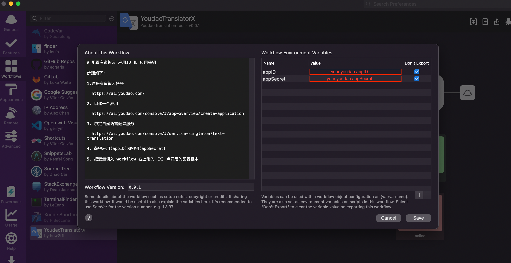
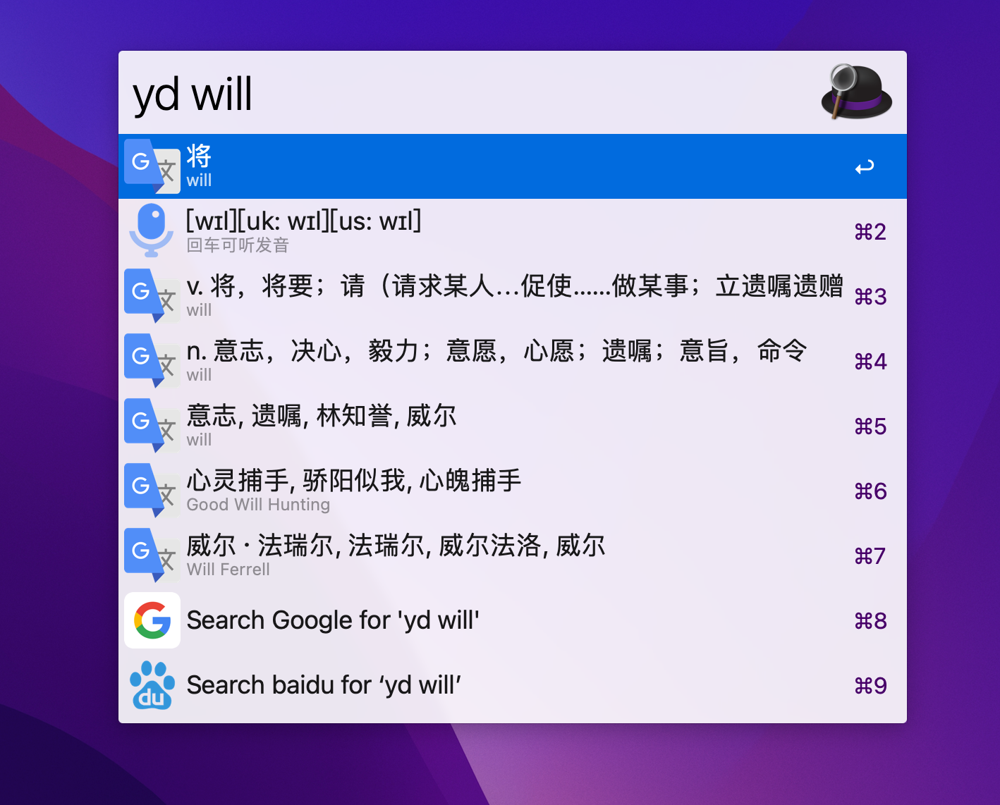

# YoudaoTranslatorX

Alfred Youdao Translate Workflow.

## Usage

1. get appID and appSecret from [youdao](https://ai.youdao.com/#/)

2. set appID and appSecret in Alfred Workflows

   

3. usage

   
